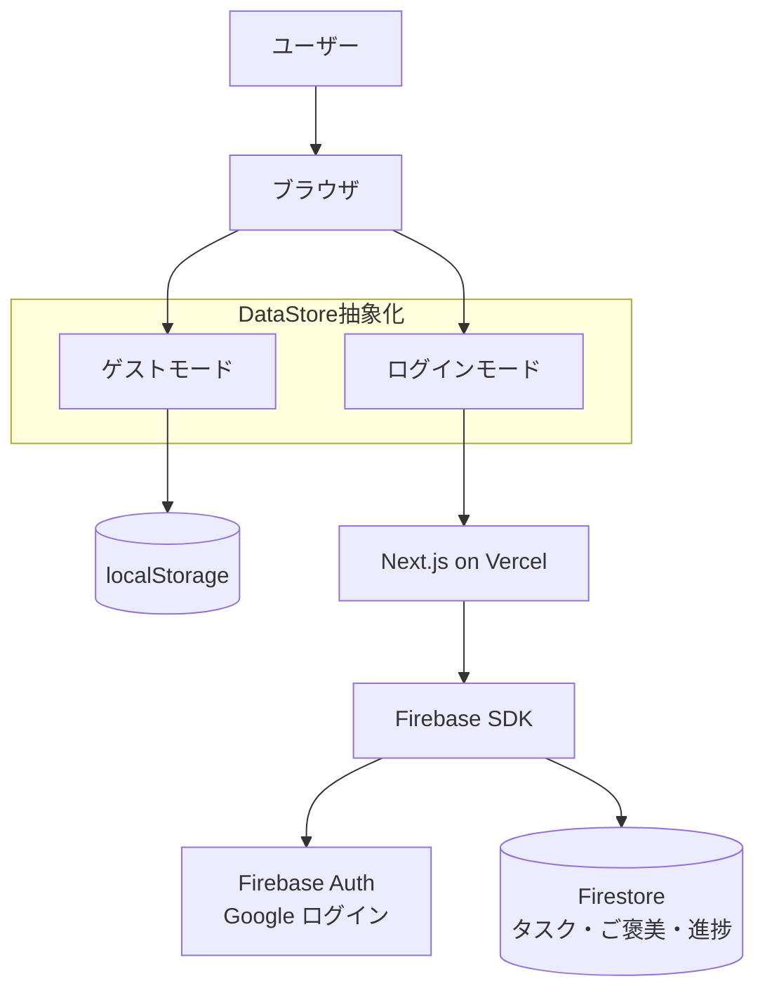

# 🎰 Rewardo

[](https://opensource.org/licenses/MIT)
[](https://nextjs.org/)
[](https://www.typescriptlang.org/)
[](https://firebase.google.com/)
[](https://tailwindcss.com/)

> **タスクをこなすと、ランダムでご褒美が当たる。行動経済学に基づいたガチャ型 Todo アプリ。**

## 📖 概要

Rewardo は「変動比率強化スケジュール」の原理を応用した Todo アプリです。スロットマシンやガチャと同じ仕組みで、タスク完了にランダムなご褒美を組み合わせることで、自然と続けたくなるモチベーション設計を実現しています。

### なぜ作ったのか

- 既存の Todo アプリはタスクを管理できても、**続けるための動機付けが弱い**という課題を感じていた
- 「次のタスクを終えたらご褒美が出るかも」という期待感で、行動を自然に促したかった
- Next.js / Firebase / dnd-kit など実践的なスタックを組み合わせた開発経験を積みたかった

## ✨ 主な機能

- **ご褒美ガチャ**: 一定数のタスクをこなすとご褒美が抽選で当たる（confetti アニメーション付き）
- **変動比率強化**: 「何タスクで発動するか」の幅をパターンとして設定でき、ランダム性が持続力を生む
- **重み付き抽選**: ご褒美ごとに確率の重みを設定。レアなご褒美も作れる
- **ドラッグ＆ドロップ**: タスクの並び順を直感的に変更できる
- **ゲスト／ログイン二段構え**: アカウント不要でもすぐ使え、Google ログインでデータをクラウド同期

## 🛠 技術スタック

| カテゴリ | 技術 |
|:--|:--|
| フロントエンド | Next.js 16 (App Router), React 19, TypeScript 5 |
| スタイリング | Tailwind CSS 4 |
| バックエンド / BaaS | Firebase Authentication (Google), Firestore |
| ライブラリ | @dnd-kit/core, @dnd-kit/sortable, canvas-confetti |
| インフラ | Vercel, Firebase |
| 開発環境 | Docker |

## 🏗 アーキテクチャ



`DataStore` インターフェースでゲスト（localStorage）とログイン（Firestore）を抽象化しており、モードを切り替えてもロジックを共通で使えます。

## 🚀 はじめ方

### 前提条件

- [Docker](https://www.docker.com/) がインストールされていること

### セットアップ（Docker 推奨）

```bash
# リポジトリをクローン
git clone https://github.com/ryusei2790/rewardo.git
cd rewardo

# 環境変数を設定
cp .env.local.example .env.local
# .env.local を編集して Firebase の値を入力

# 起動（初回は --build が必要）
docker compose up --build
```

http://localhost:3000 にアクセスできます。

> **ゲストモードのみ使う場合**は `.env.local` の Firebase 設定は不要です。

### Firebase の設定（Google ログイン / クラウド同期を使う場合）

1. [Firebase Console](https://console.firebase.google.com/) でプロジェクトを作成
2. **Authentication** → Google ログインを有効化
3. **Firestore** → 本番モードでデータベースを作成
4. プロジェクト設定の SDK 構成から `.env.local` に値を貼り付け

```env
NEXT_PUBLIC_FIREBASE_API_KEY=your_api_key
NEXT_PUBLIC_FIREBASE_AUTH_DOMAIN=your_project.firebaseapp.com
NEXT_PUBLIC_FIREBASE_PROJECT_ID=your_project_id
NEXT_PUBLIC_FIREBASE_STORAGE_BUCKET=your_project.firebasestorage.app
NEXT_PUBLIC_FIREBASE_MESSAGING_SENDER_ID=your_sender_id
NEXT_PUBLIC_FIREBASE_APP_ID=your_app_id
```

### ローカル（Docker なし）での起動

```bash
npm install
npm run dev
```

## 📄 ライセンス

このプロジェクトは [MIT License](LICENSE) の下で公開されています。
